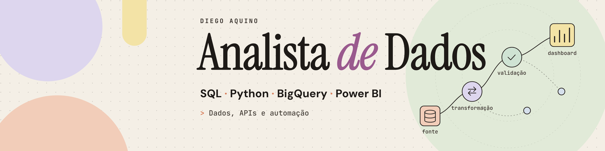

# Olá, eu sou o Diego Aquino 👋

**Analista de Dados com experiência prática em ERP, APIs, dashboards, qualidade de dados e automação.**

São Paulo, SP · [LinkedIn](https://linkedin.com/in/diegoaquino87)

## Stack

**SQL** · **Python** · **BigQuery** · **Power BI** · **Power Query** · **ETL/ELT** · **APIs REST** · **Git/GitHub** · **SQL Server**

IA entra como diferencial (por exemplo, na leitura de contratos, de notas fiscais por imagem e na análise de divergências), nunca no lugar de regra de negócio testada. Minha regra de trabalho: **IA para texto, imagem e ambiguidade; código para regra, dinheiro e validação determinística; humano para decisão crítica.**

## Projetos

Todos os repositórios têm CI no GitHub Actions. Os números de testes abaixo foram conferidos nos repositórios; onde indico "conforme o README", não executei aquele tipo de teste. Todos são projetos de portfólio, com dados fictícios ou sintéticos.

### Data / Analytics

| # | Projeto | Foco | Testes e CI | Origem |
| :-: | :--- | :--- | :--- | :--- |
| 1 | [**auditor-de-repasses**](https://github.com/diaquinodev/auditor-de-repasses) | Python, Data Quality, validação, conciliação financeira, IA aplicada | 66 testes (pytest), ruff e mypy; CI | Projeto de portfólio (dados fictícios) |
| 2 | [**conciliacao-bancaria-automacao**](https://github.com/diaquinodev/conciliacao-bancaria-automacao) | Data Integration, SQL, Python, ETL, dados sintéticos (sem bancos reais) | 30 testes automatizados; CI (Python 3.12 e 3.13) | Projeto de portfólio (dados sintéticos) |
| 3 | [**dashboard-precificacao**](https://github.com/diaquinodev/dashboard-precificacao) | Analytics, regras de negócio, visualização | 32 testes de unidade + 13 de ponta a ponta (conforme o README); CI | Projeto de portfólio |

### Applied AI / Automation

| # | Projeto | Foco | Testes e CI | Origem |
| :-: | :--- | :--- | :--- | :--- |
| 4 | [**recebimento-fiscal**](https://github.com/diaquinodev/recebimento-fiscal) · [demo pública](https://recebimento-fiscal.streamlit.app) | FastAPI, Streamlit, SQLAlchemy, SOAP/WSDL, OCR/IDP de DANFE, Gemini com function calling via OpenRouter, guardrails em código, human-in-the-loop, evals | 73 testes (pytest, executados localmente), ruff e mypy no CI; CI | Projeto de portfólio (dados fictícios, SEFAZ simulado; camada de dados **ainda não executada contra Oracle**) |
| 5 | [**wms-bling**](https://github.com/diaquinodev/wms-bling) | Integração ERP (Bling API v3), APIs, analytics operacional | 7 testes (`node --test`); CI | Projeto de portfólio |
| 6 | [**radar-marketplace**](https://github.com/diaquinodev/radar-marketplace) | Extração de dados de mercado, inteligência de preços | 25 testes (pytest); CI | Projeto de portfólio |
| 7 | [**estudio-fotos-marketplace**](https://github.com/diaquinodev/estudio-fotos-marketplace) | Full Stack + GenAI, portfólio | 61 testes (11 de migrações exigem PostgreSQL e rodam no CI); CI | Projeto de portfólio; o README traz um relato do autor sobre o contexto de origem |

## Em estudo

Itens abaixo são **estudo**, não experiência profissional, e ainda **não têm projeto** publicado:

- SQL avançado
- Modelagem de dados
- Databricks / PySpark

## Contato

Pelo [LinkedIn](https://linkedin.com/in/diegoaquino87).
